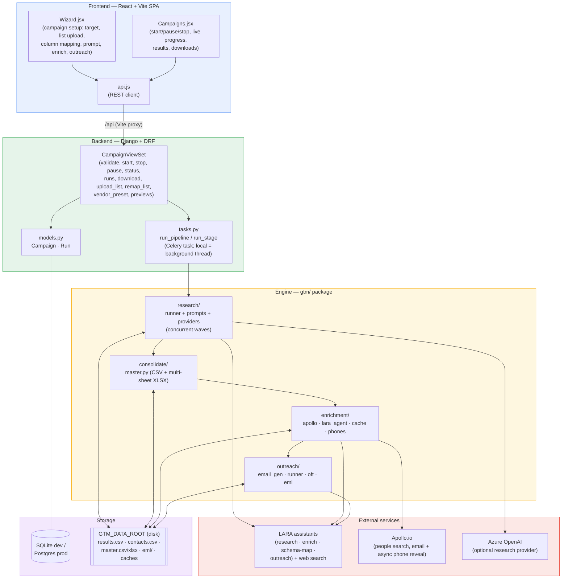
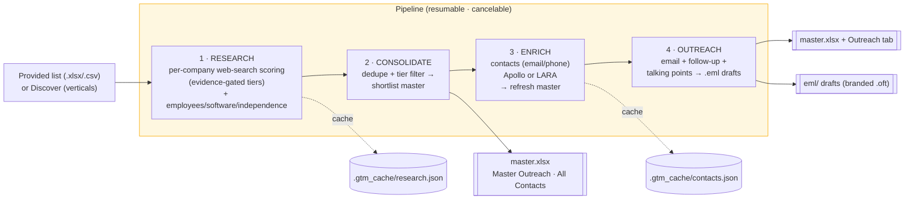
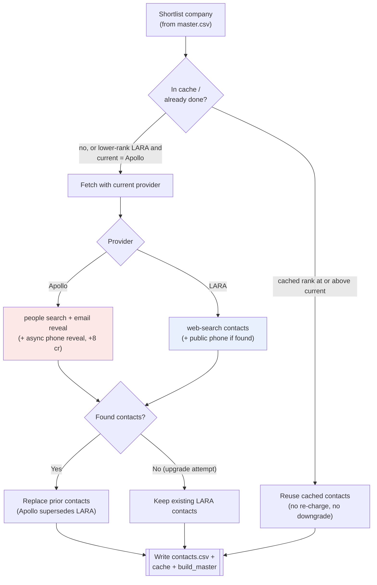
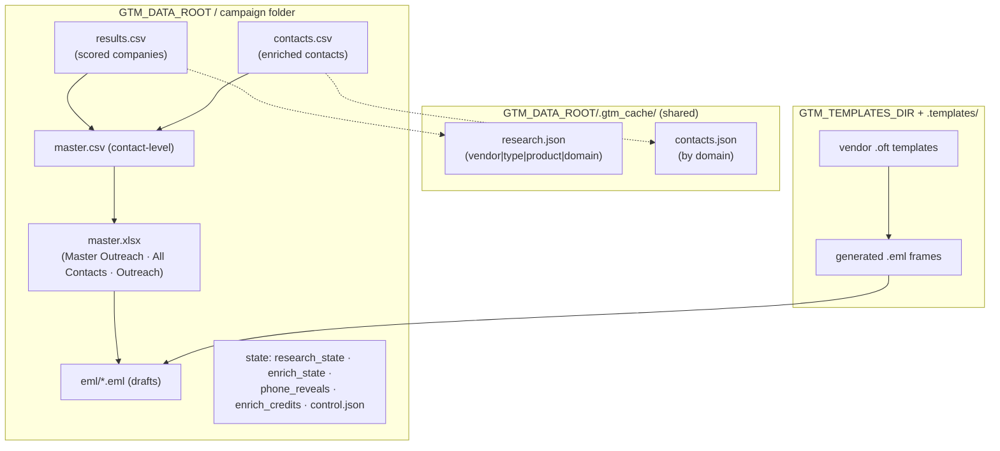

# GTM Research Platform — Architecture

Config/wizard-driven platform to **research → qualify → enrich → reach out** to target
companies (resellers or end-user accounts), for a chosen product/vendor and market.

- **Frontend:** React + Vite SPA
- **Backend:** Django + DRF (Celery in prod, background thread in dev)
- **Engine:** `gtm/` Python package (research, consolidate, enrichment, outreach)
- **External:** LARA assistants (web search), Apollo.io (contacts), Azure OpenAI (optional)
- **Storage:** SQLite (dev) / Postgres (prod) for metadata; disk artifacts under `GTM_DATA_ROOT`

---

## 1. System architecture (components & layers)

---

## 2. Pipeline flow (research → consolidate → enrich → outreach)

The pipeline runs stage by stage. Each stage is **resumable** (state saved to disk) and
**cancelable** (a `control.json` flag is checked between batches/stages).

> **Evidence-gated scoring:** without a verifiable source URL, a company cannot exceed the
> capped tier. **Concurrency:** in provided mode, research batches run in parallel waves
> (`research_concurrency`, default 3).

---

## 3. Enrichment provider logic (LARA ↔ Apollo upgrade rule)

Provider priority: **Apollo (1) > LARA (0)**. A higher-priority provider re-visits companies
already enriched by a lower-priority one, but **only overwrites when it actually finds
contacts**; otherwise the existing contacts are kept. Same-or-lower priority reuses the cache
(no re-charge, no downgrade). The contact cache is keyed by **domain** and shared across
campaigns.

> **Phones are asynchronous** (Apollo reveal, ~40 min via webhook/poll). A single pipeline run
> fires reveals but does not wait; re-run enrich (or run the webhook receiver) to merge numbers.
> **Talking points** are only generated for contacts whose phone number was obtained.

---

## 4. On-disk artifacts per campaign

---

## Deployment

| | Dev | Prod |
|---|---|---|
| Web | `manage.py runserver` | Django (docker-compose `web`) |
| Task execution | background thread (`RUN_STAGES_IN_THREAD`) | Celery worker + Redis broker |
| Database | SQLite (`db.sqlite3`) | Postgres (`DATABASE_URL`) |
| Data root | `backend/data` or `campaigns/` | `/data` volume (`GTM_DATA_ROOT`) |

## External AI assistants (LARA)

| Purpose | Env assistant id | Web search |
|---|---|---|
| Research / scoring | `LARA_RESEARCH_ASSISTANT_ID` | on |
| Contact enrichment | `LARA_ENRICHMENT_ASSISTANT_ID` | on |
| Schema (column) mapping | `LARA_SCHEMA_ASSISTANT_ID` | off |
| Outreach copy | `LARA_OUTREACH_ASSISTANT_ID` | off |
