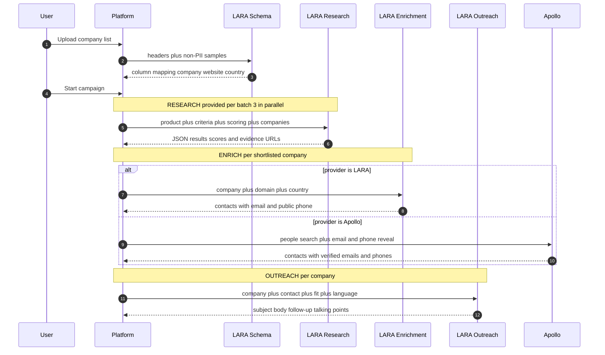

# How LARA powers the GTM Research Platform

This document explains **where and how LARA is used** in the platform, the exact
request/response contract of each LARA assistant, and what we need from the LARA team.

LARA is the **primary AI engine**. Four distinct LARA assistants are used, each with its own
purpose, system prompt, and web-search setting. Apollo.io is complementary (contact data /
phone reveals); Azure OpenAI is an optional alternate research provider.

---

## 1. Where LARA is called across the pipeline



---

## 2. The four LARA assistants

Each assistant is a thin generalist LARA agent. **All task instructions and the exact output
schema are sent by the platform in the request** — the assistant only needs a small system
prompt. The platform parses the assistant's reply as JSON (tolerant to code fences and
single-quoted output).

| # | Assistant (env id) | Web search | Called | Volume |
|---|---|---|---|---|
| 1 | `LARA_SCHEMA_ASSISTANT_ID` | off | once per list upload | 1 / campaign |
| 2 | `LARA_RESEARCH_ASSISTANT_ID` | **on** | per research batch (provided) or per product×vertical (discover) | many; **~3 concurrent** |
| 3 | `LARA_ENRICHMENT_ASSISTANT_ID` | **on** | per shortlisted company (when provider = LARA) | 1 / shortlisted company |
| 4 | `LARA_OUTREACH_ASSISTANT_ID` | off | per company at outreach | 1 / company |

Connection: every call goes to `LARA_API_URL` with a per-agent API key
(`LARA_<PURPOSE>_API_KEY`, falling back to `LARA_API_KEY`) and the assistant id. Web search is
requested per call via a flag.

---

### 2.1 Schema-mapper — map spreadsheet columns

- **Why:** stakeholder lists have arbitrary headers (e.g. `Sold To Name`, `Company Website`,
  `Office HQ`). LARA maps them to our canonical fields.
- **Privacy:** only headers + a few **non-PII** sample values are sent. Columns that look like
  email / phone / contact / id are excluded — no personal data leaves the machine.
- **Input:** `{ "headers": [...], "samples": { "<header>": ["v1","v2",...] } }`
- **Output (JSON only):**
  ```json
  {
    "company_column": "<exact header>",
    "website_column": "<exact header or empty>",
    "country_column": "<exact header or empty>",
    "context_columns": ["<software/sector/size/employees headers>"],
    "warnings": ["<short data-quality notes>"]
  }
  ```
- **Notes:** deterministic rules run first; LARA is the fallback for non-standard files. The
  platform retries a couple of times if the reply isn't parseable.

### 2.2 Research — qualify / discover companies

- **Why:** the core scoring engine. For each company it researches the web and scores fit
  against a rubric, **with a source URL required for every scored claim** (evidence-gated: no
  verifiable URL → the company cannot exceed the capped tier).
- **Input (per batch):** product + value prop, market/country (per-company country hint for
  worldwide lists), fit criteria, the scoring rubric (named dimensions with point bands), and
  the list of companies (name | website [+ country, current software, size hints]).
- **Output (JSON only):**
  ```json
  {"results": [{
    "company": "...", "website": "...",
    "employees": "size band if verifiable",
    "software_resold": "brands they sell/use",
    "independence": "Independent | Subsidiary | Acquired",
    "fit_summary": "...",
    "dimension_scores": [
      {"name": "...", "points": 0, "max": 15, "rationale": "...", "evidence_url": "https://..."}
    ],
    "recommended_products": ["..."],
    "notes": "..."
  }]}
  ```
- **Scale:** provided lists are chunked into batches; batches run in **parallel waves (default 3
  concurrent LARA calls)** so large lists finish quickly. Resumable — each completed batch is
  persisted, so a stop/restart never repeats a scored company. A shared research cache reuses a
  company's analysis across runs (keyed by vendor|target|product|domain).

### 2.3 Enrichment — resolve decision-maker contacts

- **Why:** find the right people to contact (owner, C-suite, VP, director, channel/BD managers)
  for each shortlisted company, using web search (no Apollo credits).
- **Input:** one company (name + domain + **its own country**), max contacts, language.
- **Output (JSON only):**
  ```json
  {"contacts": [{
    "contact_name": "...", "title": "...",
    "email": "verified public email or empty",
    "phone": "public phone in international format or empty",
    "phone_type": "direct | corporate | empty",
    "linkedin": "https://linkedin.com/in/... or empty",
    "source_url": "URL actually consulted"
  }]}
  ```
- **Notes:** never invents emails/phones; every contact carries a real `source_url`. LARA finds
  **public** numbers (usually a corporate line). **Personal/direct mobiles are Apollo's job**
  (an async reveal against a contact database, not the public web).

### 2.4 Outreach — write the email + follow-up + call script

- **Why:** generate ready-to-send, personalized copy per company.
- **Input:** company, contact (name + title), why they fit, recommended products, product,
  sender, target language.
- **Output (JSON only):**
  ```json
  {
    "subject": "...", "body": "...",
    "followup_subject": "Re: <subject>", "followup_body": "...",
    "talking_points": "• bullets for a phone call (only when a phone was obtained)"
  }
  ```
- **Notes:** written in the target language (auto-derived from the company's country for
  worldwide lists). Talking points are requested **only** when a phone number exists.

---

## 3. What we need from the LARA team

1. **Assistant provisioning** — confirm the four assistant ids, the endpoint (`LARA_API_URL`),
   and per-agent API keys (or a single key). Confirm which assistants can enable **web search**.
2. **Strict JSON output** — all four rely on JSON-only replies. Best results come from a system
   prompt that returns *only* a JSON object (no prose/markdown). Can we lock this behavior?
3. **Concurrency / rate limits** — research runs **~3 parallel** calls (configurable higher).
   What concurrency and per-minute limits can we rely on? Any burst throttling to design around?
4. **Latency** — typical response time for a web-search research call? This drives batch size
   and concurrency (goal: avoid multi-hour runs).
5. **Payload limits** — max prompt size / token budget per call (affects how many companies we
   put in one research batch).
6. **Web-search quality by market & language** — coverage for worldwide markets (e.g. Hong
   Kong) and non-English content; ability to return local-language names/titles as published.
7. **Reliability / errors** — expected error codes (we saw transient HTTP 499s) and retry
   guidance; we already resume on failure without re-charging completed work.
8. **Cost model** — per-call vs per-token pricing, and whether web-search calls cost more.

---

## 4. Configuration reference

```
LARA_API_URL=...                      # shared endpoint
LARA_API_KEY=...                      # fallback key for all assistants

LARA_RESEARCH_ASSISTANT_ID=...        # web search ON
LARA_RESEARCH_API_KEY=...             # optional per-agent key

LARA_ENRICHMENT_ASSISTANT_ID=...      # web search ON
LARA_ENRICHMENT_API_KEY=...

LARA_SCHEMA_ASSISTANT_ID=...          # web search OFF
LARA_SCHEMA_API_KEY=...

LARA_OUTREACH_ASSISTANT_ID=...        # web search OFF
LARA_OUTREACH_API_KEY=...
```

See also [architecture.md](architecture.md) for the full system diagram.
